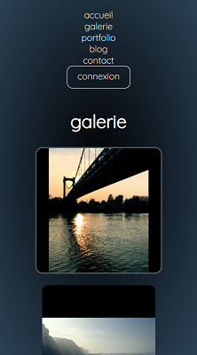

# Projet Nature

> Ce projet a été fait pendant mon année de formation à l'AFPA. Il s'agit d'un prototype de portfolio pour un photographe. 
> Beaucoup de fonctionnalités du cahier des charges initial n'ont pas été réalisées par manque de temps ; uniquement les parties demandées par le formateur pour les ECF (évaluations passées en cours de formations) ont été faites. 

- Cahier des charges : [CAD](/assets/CDC_nature.md). 

- Dictionnaire des données : [DDD](/assets/DDD_nature.pdf). 

- Modèle conceptuel des données : 

 

- Listes des fonctions principales à mettre en oeuvre pour les ECF : [Travail à effectuer](/assets/CDC_nature_ECF.md). 

 

## Technos du projet
> **Front** : HTML - CSS - JS - Library JS AOS  
> **Back** : PHP (structure MVC), SQL  
> **SGBD** : SQL Server   
> *Note : Pour la structure MVC je me suis basé sur la méthode proposée sur la chaine **Nouvelle Techno*** (https://www.youtube.com/watch?v=of2yADpLtQE&t=2s)

 

## Page d'accueil
 

## Galerie photo
 

  

## Blog
> La page pour écrire un article apparaît uniquement si l'utilisateur connecté à le rôle "admin"

 

## Easter Egg
> Espace caché du site. Par exemple la commande "run hangman" sur la capture ci-dessous, permet de lancer le jeu du pendu.

 